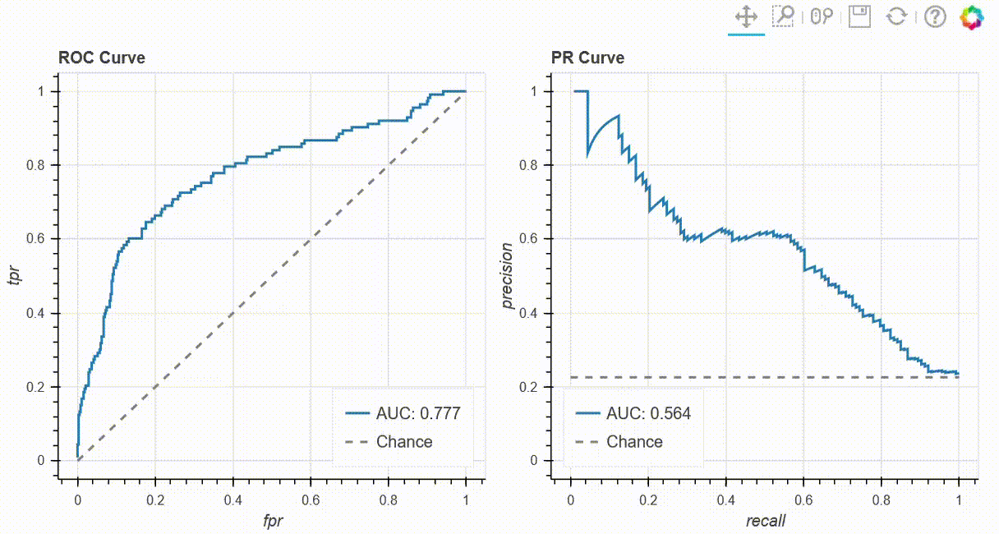

# Interactively Informative Performance Curves

This interactive visualization builds upon Receiver operating characteristic
(ROC) and/or Precision-Recall (PR) curve.  
It utilizes the basic concept that the curves take a continuous output of a
classifier (e.g., probability of class or distance from decision boundary),
and apply cutoffs across the range of predictions to obtain different
binary classifications. 
For those binary classification, it then calculates a confusion-matrix 
statistics (number of true-positives, number of false-positives, etc.) 
in order to obtain precision, recall, or false positive rate.  
These statistics, over different cutoff values composes the vectors that,
in turn, drawn as the curves.

Since different cutoffs lead to different classification performances,
it is of interest to evaluate multiple metrics for any given cutoff.  
Any point on the PR/ROC curve corresponds to some cutoff, so for any such
point, while hovering over it, different classifications metrics can
be presented in an interactive way.



## Usage
The minimal API is compatible with Scikit-learn's API for ROC or PR curve.  
```python
from sklearn.datasets import make_classification
from sklearn.linear_model import LogisticRegression
from bokeh.plotting import show
from rocnroll import plot_roc_curve

X, y = make_classification()
clf = LogisticRegression()
clf.fit(X, y)
y_pred = clf.predict_proba(X)[:, 1]

p = plot_roc_curve(y, y_pred)
show(p)
```

A full example resulting with the GIF above can be found in the 
[example.py](example.py) script.
 

### Providing metrics
The plot functions `plot_roc_curve` and `plot_pr_curve` can be provided with a
set of desired metrics.  
Classification metrics are divided into two subtypes according to their input:
1. Metrics that operate on a class prediction and that would be evaluated for
   every cutoff are to be provided through `BINARY_METRIC_FUNCS`.
1. Metrics that operate on a score prediction (such as output from sklearn's
   `predict_proba` or `decision_finction`) and that would be evaluated
   once (on the prediction input provided to the plot) are to be provided 
   through `SCORES_METRIC_FUNCS` ("scores" as in the continuous output a
   classifier can output).

If not specified by user, all the metrics specified in `BINARY_METRIC_FUNCS` 
and  `SCORES_METRIC_FUNCS` will be evaluated.  

Score functions are provided as a `dict()` which key is the metric name 
(e.g., `'accuracy'`), and value is a callable (e.g., `accuracy_score`). 
Any metric from Scikit-learn's 
[classification `metrics`](https://scikit-learn.org/stable/modules/model_evaluation.html#classification-metrics)
can be used.

#### Providing custom metrics
User can also provide custom metric functions as long as they compatible with the
signature:
```
def some_scorer(y_true, y_pred, sample_weights=None, **kwargs)
```
The custom metric does not have to support `sample_weight` (i.e., it can ignore 
it), but a `sample_weight` (even if `None` as in default) will be provided to
the function through keyword arguments.  
See more in [Implementing your own scoring object](https://scikit-learn.org/stable/modules/model_evaluation.html#implementing-your-own-scoring-object)

Furthermore, users can provide custom metrics in case they wish to change default
behaviour of the scorer.  
In the following example we provide two scorers to the plot.  
One is `lambda` wrapper for `fbeta` score that implements f2-score (overwriting
default parameter of the function), 
and the second provides a function not found under the default 
`BINARY_METRIC_FUNCS` that wouldn't be evaluated if we haven't provided it
explicitly.
```python
from sklearn import metrics
from rocnroll import plot_pr_curve

binary_metric_funcs = {"f2score": lambda y, y_pred, sample_weights=None:
                                   metrics.fbeta_score(y, y_pred, beta=2,
                                                       sample_weight=sample_weights),
                       "bal_acc": metrics.balanced_accuracy_score}
plot_pr_curve(y_true, y_prob, binary_metric_funcs=binary_metric_funcs)
```
Another option, if the user wishes to add or remove specific scores from the
default list, they can simply manipulate `BINARY_METRIC_FUNCS`:
```python
from sklearn import metrics
from rocnroll import plot_pr_curve
from rocnroll.performance_curves import BINARY_METRIC_FUNCS
# Add balanced_accuracy to the list of metrics to be evaluated
BINARY_METRIC_FUNCS.update({"bal_acc": metrics.balanced_accuracy_score})
# Remove log_loss from the list of metrics to be evaluated:
BINARY_METRIC_FUNCS.pop("log_loss")
# Call plot:
plot_pr_curve(y_true, y_prob, binary_metric_funcs=BINARY_METRIC_FUNCS)
```


## Dependencies
The code requires:
* _pandas_   
  used to hold the evaluation results in an orderly fashion.
* _scikit-learn_  
  used for its `metrics` module.
* _bokeh_ (0.12.13)  
  used for the actual plotting. 
  Was not tested on versions 1.x.yy, but since it uses fairly basic 
  mechanisms of the package, I'm hopeful it works. 


## Release notes
This package will most likely not be maintained.  
Users are encouraged to clone/download the source code and use it in their
project directly, further tweaking it for their need.
It's suppose to be a fairly simple piece of code 
(half of the lines are docstring, promise).
 
Will be happy to answer any concerns and discuss via Github issues.

